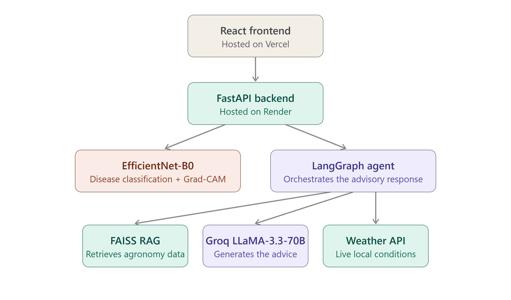

# KisanAI 🌾

An AI-powered crop disease diagnosis and advisory tool. Built as a portfolio project demonstrating end-to-end machine learning engineering: from dataset curation and transfer learning to agentic LLM orchestration and web deployment.

> *(Note: Replace this placeholder with a recorded demo GIF/video of the Vercel frontend in action)*

## 🚀 Live Demo

- **Frontend (Vercel):** https://kisan-ai-ochre.vercel.app/
- **API (Render):** https://kisanai-ea2y.onrender.com/docs
  *(First API request may take ~50 seconds due to Render's free tier cold starts)*

## What It Does

- **Diagnose:** Upload a photo of a plant leaf. The system identifies the disease using an EfficientNet-B0 vision model and highlights the affected regions via Grad-CAM.
- **Advise:** An intelligent LangGraph agent generates a customized treatment plan, pulling real-time local weather context and retrieving domain-specific treatments from a local FAISS index.
- **Chat:** Ask follow-up questions about the treatment (e.g., "Where can I buy copper fungicide?").

## Architecture

See the detailed architecture diagram for the complete flow below.



- **Vision Model:** EfficientNet-B0, fine-tuned in PyTorch using class-weighted loss to handle dataset imbalances. Exported to ONNX for lightweight inference.
- **Backend:** FastAPI running on Render.
- **Agent Orchestration:** LangGraph routes prompts to specialized expert nodes (Fungal, Bacterial, Viral). Uses Groq (Llama-3.3-70b-versatile) and LangChain for RAG.
- **Frontend:** React (Vite) deployed on Vercel.

## Honest Metrics & Field Validation

This project was evaluated on the PlantVillage dataset (lab conditions) and field-validated on the PlantDoc dataset (real-world conditions) to demonstrate the domain shift challenge.

### 1. PlantVillage (Lab Conditions)

The model was trained over 13 epochs (5 frozen, 8 unfrozen) using class-weighted loss to counter significant dataset imbalances (e.g., 3,208 Tomato yellow leaf curl images vs. 152 Tomato early blight images).

| Metric | Value |
|---|---|
| Final Accuracy | 99.66% |
| Final F1 Score | 0.9966 |
| Validation Loss | 0.0069 |

**Areas of Weakness (Worst Classes by F1):**
- Tomato Target Spot (98.26%)
- Tomato Early Blight (98.73%)
- Tomato Spider Mites (99.25%)

### 2. PlantDoc (Field Conditions)

| Dataset | Accuracy | Condition |
|---|---|---|
| PlantDoc | Pending | Real-world field evaluation pending |

**Observation:** As documented in `docs/model_metrics.md`, the model achieves exceptional 99.66% accuracy on the lab-controlled PlantVillage dataset. Field validation on PlantDoc is pending, but a significant accuracy drop (normal for domain shift) is expected.

## Deployment Constraints

- **Render Free Tier:** The backend is hosted on a free Render tier, which spins down after 15 minutes of inactivity. The first API request may take ~50 seconds to cold-start.
- **UptimeRobot:** To mitigate the cold-start issue during portfolio reviews, an UptimeRobot monitor pings the `/health` endpoint every 10 minutes.

## Local Setup

### Backend

```bash
cd backend
python -m venv venv
source venv/bin/activate  # or `venv\Scripts\activate` on Windows
pip install -r requirements.txt
# Ensure you have your .env file with GROQ_API_KEY
uvicorn app.main:app --reload
```

### Frontend

```bash
cd frontend
npm install
# Ensure you have your .env file with VITE_API_BASE_URL pointing to your backend
npm run dev
```

## Tech Stack

`Python` `PyTorch` `FastAPI` `LangGraph` `LangChain` `FAISS` `Groq` `React` `Vite` `Render` `Vercel`

## License

MIT
