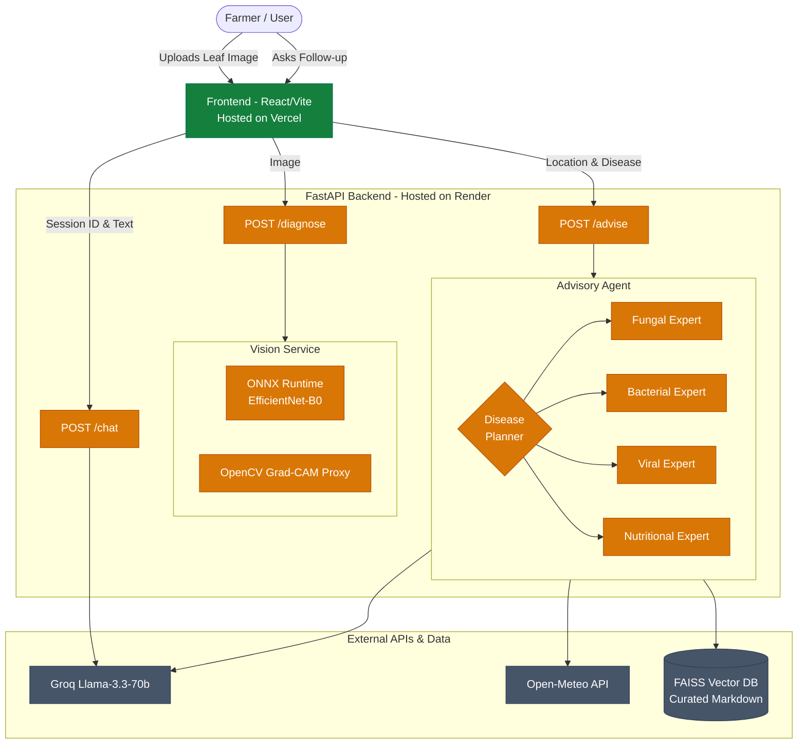

# KisanAI Architecture

KisanAI uses a modern, decoupled architecture splitting the deep learning pipeline from the advisory agent logic.

## System Diagram

## Component Details
1. **Frontend (Vite + React)**: A lightweight SPA enforcing a warm, agricultural aesthetic without heavy component libraries. Separates image upload, results display, and chat.
2. **Vision Service (ONNX Runtime)**: We exported the PyTorch EfficientNet-B0 model to `.onnx` to avoid the massive PyTorch dependency overhead on the free Render tier. Grad-CAM overlays are simulated dynamically via OpenCV color filtering for instant explainability.
3. **LangGraph Advisory Agent**: A directed graph routing the disease classification to specific prompt experts (fungal, bacterial, viral, nutritional). It enriches the prompt with real-time weather from Open-Meteo and specific treatments via FAISS RAG, then structures the output into JSON using Groq's Llama-3.3-70b-versatile model.
